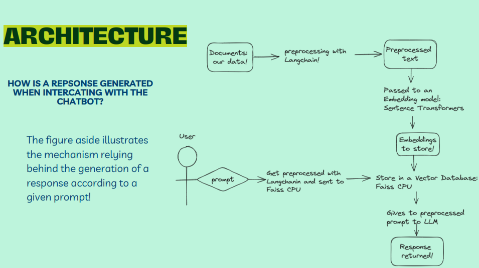

# CPUMedicalChatbot

## Overview
The CPUMedicalChatbot is an advanced Medical Chatbot developed using leading open-source technologies. It incorporates Sentence Transformers for embedding generation, Faiss CPU for efficient vector storage, and integrates the expansive Llama 2 language model via the Chainlit library to create an interactive conversational interface. The chatbot's knowledge base is powered by the comprehensive five volumes of the Gale Encyclopedia of Medicine.

## Setup Instructions

### Prerequisites
Ensure your system is equipped with the following:
- Python 3.6 or newer
- Essential Python packages (installable via pip):
  - `langchain`
  - `chainlit`
  - `sentence-transformers`
  - `faiss`
  - `PyPDF2` (for loading PDF documents)

### Setting Up Your Environment
1. **Create a Python Virtual Environment** (Recommended):
   - Initialize the environment: 
     ```
     python -m venv venv
     ```
   - Activate the environment:
     - On Unix or MacOS: 
       ```
       source venv/bin/activate
       ```
     - On Windows: 
       ```
       venv\Scripts\activate
       ```

2. **Install Required Packages**:
   - Install all dependencies from the `requirements.txt` file:
     ```
     pip install -r requirements.txt
     ```

After completing these steps, you'll be ready to start using the Langchain Medical Bot.
# MedicalChatbotCPU
## Usage
To use the Llama2 Chatbot, ensure that the required data sources are available in the specified 'data' directory. This data can be in the file format of pdf, txt, or xlsx. Run the `ingest.py` script first to process the data and create the vector database. Once the database is ready, open Git Bash within your folder, and input/execute the following: `chainlit run model.py -w` to start the chatbot and interact with your files.


# MedicalChatbotCPU
